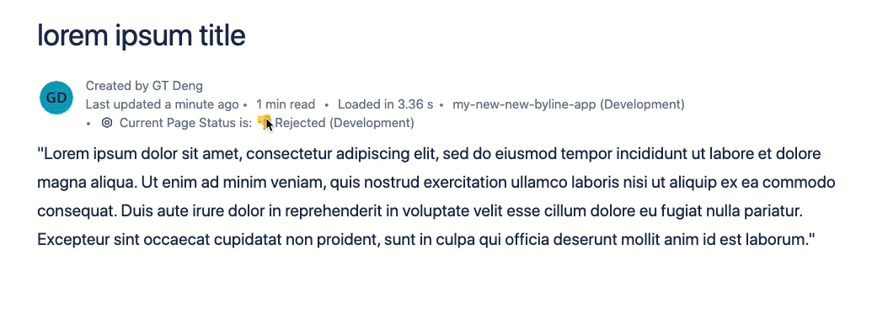

# Page Approver: a Byline Forge App with Dynamic Properties

[](LICENSE)

This is an example [Forge](https://developer.atlassian.com/platform/forge/) app that showcases how to utilize the DynamicProperties property within a Confluence Byline Forge App to dynamically update the `title`, `icon`, and `tooltip`.

## Usage

Click on the Forge App within the Byline to trigger an open inline dialog where the page can either be approved or rejected. This will update the [page content properties](https://developer.atlassian.com/cloud/confluence/rest/api-group-content-properties/). The Forge App title will update upon closing of the inline dialog.



## Requirements

See [Set up Forge](https://developer.atlassian.com/platform/forge/set-up-forge/) for instructions to get set up.

## Installation

1. Follow the instructions on [Example Apps](https://developer.atlassian.com/platform/forge/example-apps/) to copy, deploy, and install this Forge app.

- Register your forge app by running:

```
forge register
```

- Install the dependencies by running:

```
npm install
```

- Build and deploy your app by running:

```
forge deploy
```

- Install your app in an Atlassian site by running:

```
forge install
```

- Develop your app by running `forge tunnel` to proxy invocations locally:

```
forge tunnel
```

## Debugging

You can use the [`forge tunnel`](https://developer.atlassian.com/platform/forge/change-the-frontend-with-forge-ui/#set-up-tunneling) command to run your Forge app locally.

You can take a look at the [`dynamicProperties with byline documentation`](https://developer.atlassian.com/platform/forge/manifest-reference/modules/#confluence-content-byline-item) for reference.

### Notes

- Use the `forge deploy` command when you want to persist code changes.
- Use the `forge install` command when you want to install the app on a new site.
- Once the app is installed on a site, the site picks up the new app changes you deploy without needing to rerun the install command.

## Support

See [Get help](https://developer.atlassian.com/platform/forge/get-help/) for how to get help and provide feedback.

## License

Copyright (c) 2021 Atlassian and others.
Apache 2.0 licensed, see [LICENSE](LICENSE) file.

[](https://www.atlassian.com)
