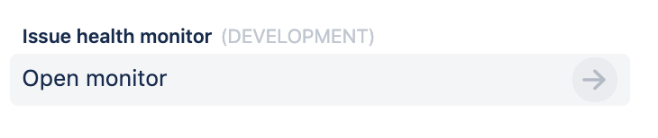
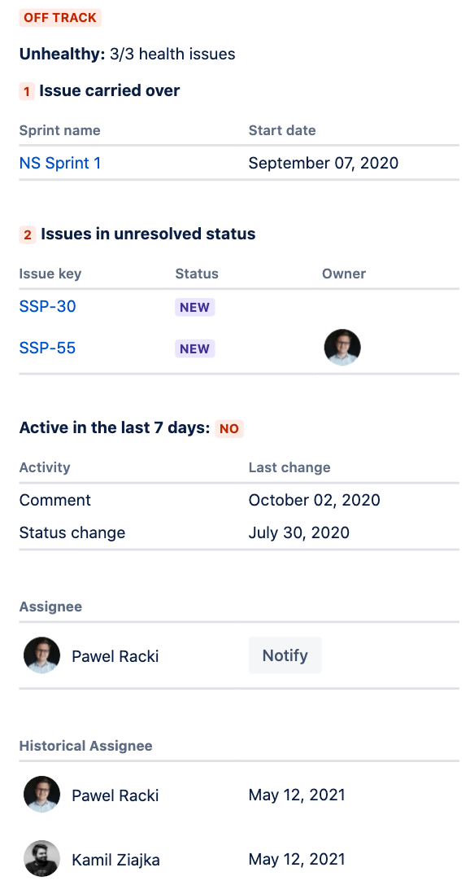
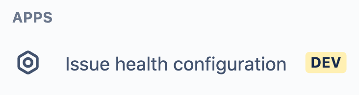
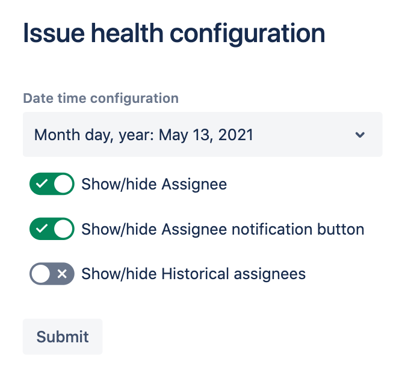

# Issue Health

 

## Description

This Forge app provides insight into the health of Jira issues. The app determines issue health using
the number of unresolved issues linked, number of days without updates, and how many sprints have contained the issue.

## Requirements

See [Getting Started](https://developer.atlassian.com/platform/forge/getting-started/) for instructions to get set up.

## Quick start

Once you have logged into the CLI (`forge login`), follow the steps below to install the app onto your site:

1. Clone this repository
2. Run `forge register` to register a new copy of this app to your developer account
3. Run `npm install` to install your dependencies
4. Run `forge deploy` to deploy the app into the default environment
5. Run `forge install` and follow the prompts to install the app

### Issue Glance

The app adds the *Open Issue Health Monitor* button using an 
[issue glance](https://developer.atlassian.com/platform/forge/manifest-reference/modules/jira-issue-glance)
which displays alongside fields such as Assignee and Labels.

Clicking on the issue glance button opens a panel that displays the issue's health using Forge UI.

### Admin Page

The app also adds configuration using an [admin page](https://developer.atlassian.com/platform/forge/manifest-reference/modules/jira-admin-page).

Clicking on the navigation item opens the admin page that displays the app configuration.

## Usage

Issue health uses the Jira Software sprint custom field, if enabled. Without it
the app will only check for blocker issues and issue age.

To enable the Jira Software sprint custom field:

1. Choose **Jira Settings** > **Issues**.
1. Select **Fields** > **Custom Fields**.
1. Ensure the **Sprint** *(Jira Software sprint field)* is enabled.

## Documentation

The app's [manifest.yml](./manifest.yml) contains two modules:

1. A [jira:issueGlance module](https://developer.atlassian.com/platform/forge/manifest-reference/modules/jira-issue-glance)
that specifies the metadata displayed to the user using a [Glance](https://developer.atlassian.com/cloud/jira/platform/modules/issue-glance/) 
   in the Jira Issue View. The `jira:issueGlance` uses the following fields:
  
    * `title` displayed above glance button.
    * `label` displayed on glance button.
    * `status` lozenge displaying ">>".
   
1. A [jira:adminPage module](https://developer.atlassian.com/platform/forge/manifest-reference/modules/jira-admin-page) 
that specifies the metadata displayed to the user using an [Admin page](https://developer.atlassian.com/cloud/jira/platform/modules/admin-page/) 
   in the Jira apps panel. The `jira:adminPage` uses the `title` value when displayed in navigation panel.

1. A corresponding [function module](https://developer.atlassian.com/platform/forge/manifest-reference/modules/function/)
that implements the issue glance and admin page logic.

The function logic is implemented in four files:

* [src/index.jsx](./src/index.jsx): Contains the main logic and UI elements of the app.
* [src/config.jsx](./src/config.jsx): Contains configuration logic and UI elements of configuration page.
* [src/helpers.js](./src/helpers.js): Contains helper functions.
* [src/constants.js](./src/constants.js): Contains set of constants.

The app's UI is implemented using these features:

- [`IssueGlance`](https://developer.atlassian.com/platform/forge/ui-components/issue-glance) component
- [`Avatar`](https://developer.atlassian.com/platform/forge/ui-components/avatar) component
- [`AvatarStack`](https://developer.atlassian.com/platform/forge/ui-components/avatar-stack) component
- [`Button`](https://developer.atlassian.com/platform/forge/ui-components/button) component
- [`Text`](https://developer.atlassian.com/platform/forge/ui-components/text) component
- [`SectionMessage`](https://developer.atlassian.com/platform/forge/ui-kit-components/section-message) component
- [`ModalDialog`](https://developer.atlassian.com/platform/forge/ui-components/modal-dialog) component
- [`Form`](https://developer.atlassian.com/platform/forge/ui-components/form) component
- [`Lozenge`](https://developer.atlassian.com/platform/forge/ui-components/lozenge) component
- [`Table`](https://developer.atlassian.com/platform/forge/ui-components/table) component
- [`useState`](https://developer.atlassian.com/platform/forge/ui-hooks-reference/#usestate)
- [`useEffect`](https://developer.atlassian.com/platform/forge/ui-kit-hooks-reference/#useeffect)
- [`useProductContext`](https://developer.atlassian.com/platform/forge/ui-hooks-reference/#useproductcontext)

The app uses the [storage api](https://developer.atlassian.com/platform/forge/runtime-reference/storage-api/) to store app configuration.

## Contributions

Contributions to Issue Health are welcome! Please see [CONTRIBUTING.md](CONTRIBUTING.md) for details.

## License

Copyright (c) 2021 Atlassian and others.
Apache 2.0 licensed, see [LICENSE](LICENSE) file.
